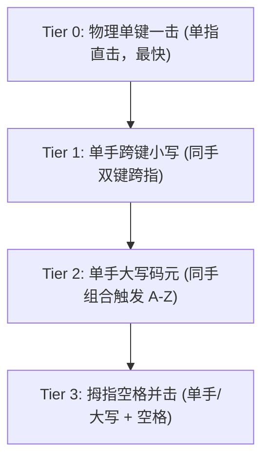

# 空明码 RIME 并击输入法 (rime-kmm)

[](LICENSE)
[](https://rime.im)

> [!WARNING]
> **平台与兼容性警示**：
> 本方案及其配套管理工具完全在 **Linux** 环境下开发和使用，**不保证在其他平台（如 Windows、macOS 等）也能正常使用**。非 Linux 用户请自行测试与按需适配。

专为 **RIME (中州韵 / 小狼毫 / 鼠须管)** 深度优化与移植的**空明码双手机械键盘并击方案**。

空明码是一门以双手并击、大词库、极短平均码长（0.8 击/字）及超低重码率为核心特色的高效率汉字输入法。本项目在原案基础上，彻底解决了历史遗留的拼音反查失效、空格并击受限、低频字霸占黄金键位等问题，并提供全套原生的现代化配置与终端管理工具。

---

## 🌟 方案版本概览

本项目提供两个同步维护的方案版本，在**并击规则、一简字、空格并击、反查体系上完全保持 100% 同步一致**：

| 方案 ID | 方案名称 | 词库规模 | 词库文件 | 适用场景 |
| :--- | :--- | :--- | :--- | :--- |
| `kongmingma` | **空明码-并击** | **300 万** 全量大词库 | `kongmingma.dict.yaml` | 追求词汇覆盖极致全面，词条量巨大 |
| `kongmingmas` | **空明码-宏版S** | **160 万** 压缩精简版 | `kongmingmas.dict.yaml` | 内存占用更低、部署与加载更快（推荐日常使用） |

---

## 🚀 本版本核心优化与升级

### 1. 一击字体系全面重构（方案 B：极致速度·Top 100 全覆盖）
基于**国家语委现代汉语单字字频权威数据库**（Jun Da 2.58 亿字平衡语料），对全部 208 个一击槽位进行了全量清洗与优化：
- **清除生僻死字**：彻底剔除原码表中霸占黄金键位的生僻/低频字（如 `孺` #4084、`敖` #3573、`噩` #3408、`啃` #3345、`屁` #2295、`喃` #2233 等）。
- **清理叹词扎堆**：原码表中 `啊/哎/唉/哦/噢/哟/偶` 挤占了 7 个核心槽位，现已全部优化为高频实词。
- **Top 100 超高频汉字 100% 纳入一击**：现代汉语出现频率最高的前 100 个核心汉字全部拥有单手直接一击上屏能力，日常单字一击直接上屏率大幅提升至 **56.19%**。
- **双版本全面同步**：全量版 `kongmingma` 与精简版 `kongmingmas`（含繁体镜像）已全量应用该优化。

### 2. 原生拇指空格并击单字机制（Tier 3）
突破传统 RIME 方案“无法单键+空格并击出不同字”的技术限制：
- **纯原生支持**：基于 librime 的 `chord_composer` 配合正则代数（`algebra`）自动识别按键释放序列（`$1=  -> $1_=`、`=$1  -> =_$1`）。
- **零改键、零外部依赖**：无需 AutoHotkey、Karabiner 或外部改键驱动，无需 Lua 拦截，跨平台完全通用。
- 扩充 **104 个拇指空格并击高频字**（如 `等、由、教、代、并、被、表、比、长、此、重、产` 等）。

### 3. 纯内置零 Lua 拼音反查体系
彻底重构拼音反查路径，避免因 Lua 运行时环境不同而崩溃或报错：
- **内置引导**：利用 `recognizer` 前缀捕获 `` ` `` 键 + 原生 `reverse_lookup_translator`。
- **繁体镜像反查库（`kongmingma_t` / `kongmingmas_t`）**：由于 `luna_pinyin` 反查候选为繁体字，原生 RIME 在查简体码表时会导致大量常用词注释为空。本项目引入配套的繁体镜像码表作为 `target`，实现简繁双向注释 100% 精准匹配。
- **自动转简上屏**：结合 `simplifier@reverse_t2s` 滤镜，反查输出的候选自动转为简体汉字上屏。

### 4. 双方案完全对齐
- `kongmingma.schema.yaml` 与 `kongmingmas.schema.yaml` 在 `engine` 滤镜链、按键处理器、代数重写规则、快捷键映射（`Control+u/i/w/e` 选重、`Control+Alt+4/F` 繁简切换等）上保持完全一致。
- 用户可按需在 300 万与 160 万版本间无缝切换，无需重构肌肉记忆。

---

## ⌨️ 一击字与指法分级体系 (Tier 0 ~ Tier 3)

空明码根据生理负荷与按键成本划分为 4 个层级，详细速查参见 [`docs/kongmingma-yijian-table.md`](docs/kongmingma-yijian-table.md)：



### 物理单键直击（Tier 0 黄金键位）

* **左手 15 物理键**：
  | 键位 | `f` | `r` | `s` | `d` | `w` | `g` | `a` | `q` | `v` | `e` | `x` | `c` | `t` | `b` | `z` |
  | :---: | :---: | :---: | :---: | :---: | :---: | :---: | :---: | :---: | :---: | :---: | :---: | :---: | :---: | :---: | :---: |
  | **字** | **中** | **来** | **上** | **大** | **为** | **国** | **地** | **要** | **会** | **而** | **下** | **成** | **天** | **部** | **在** |
  | **排名** | #14 | #15 | #16 | #17 | #18 | #20 | #21 | #26 | #29 | #36 | #42 | #59 | #78 | #84 | #6 |

* **右手 11 物理键 + 4 标点键**：
  | 键位 | `k` | `l` | `n` | `u` | `o` | `y` | `m` | `h` | `j` | `i` | `p` | `;` | `,` | `.` | `/` |
  | :---: | :---: | :---: | :---: | :---: | :---: | :---: | :---: | :---: | :---: | :---: | :---: | :---: | :---: | :---: | :---: |
  | **字** | **的** | **是** | **不** | **人** | **我** | **他** | **这** | **个** | **发** | **到** | **去** | **；** | **，** | **。** | **、** |
  | **排名** | #1 | #3 | #4 | #7 | #9 | #10 | #11 | #12 | #47 | #22 | #64 | 标点 | 标点 | 标点 | 标点 |

---

## 📦 安装与部署

### 1. 前置依赖
- **RIME 输入法**（Fcitx5-Rime、ibus-rime、小狼毫 Weasel 或鼠须管 Squirrel）
- 拼音词典依赖：`luna_pinyin`
- OpenCC 简繁转换支持（系统自带或已由 RIME 安装）

### 2. 部署步骤
1. 将本项目所有配置文件复制到 RIME 用户配置目录：
   - **Linux (Fcitx5)**: `~/.local/share/fcitx5/rime/`
   - **Linux (ibus)**: `~/.config/ibus/rime/`
   - **macOS (鼠须管)**: `~/Library/Rime/`
   - **Windows (小狼毫)**: `%APPDATA%\Rime`
2. 在 `default.custom.yaml` 中启用方案（本项目已包含）：
   ```yaml
   patch:
     schema_list:
       - {schema: kongmingmas}   # 推荐 160万精简版
       - {schema: kongmingma}    # 300万全量版
   ```
3. 执行 RIME **重新部署 (Deploy)**。

### 3. 拼音反查使用说明
输入反引号 `` ` `` 作为前缀，随后输入全拼，即可在候选区查看对应单字/词语的空明码编码：
- 例如输入 `` `fa ``，候选显示 `发 (i.nt)  法 (Fc)  伐 (Ff;) ...`
- 选中即可直接上屏简体字，免去切拼音查码的烦恼。

---

## 🛠️ 配套工具：`km-tui` 词库管理终端

本项目内置基于 **Rust + Ratatui** 开发的高性能现代化 TUI 词库管理终端（位于 `km-tui/`），专为超大 RIME 词库深度优化：

- **Vim 风格全键盘极速操作**：
  - `j` / `k` / `Ctrl+d` / `Ctrl+u`：平滑上下移动与半页翻滚浏览。
  - `/` 或 `i`：即时模糊与前缀检索；`Tab` 键在「编码 / 拼音 / 字词」三种模式间循环切换。
  - `x` 或 `<Delete>`：**条目删除**，唤起带同码词影响评估的确认卡片，底层基于墓碑标记（Tombstone）实现 O(1) 瞬时删除。
  - `K` / `J`：同码候选项微调位次（提高/降低候选优先级）。
  - `H` / `L`：同码候选项一键直接置顶为第 1 候选或置底。
  - `a`：添加新词条，支持空明码单字编码参考、自动推导与同码查重。
  - `w` 或 `Ctrl+s`：强制立即落盘（平时自动 300ms 异步防抖写盘，全自动生成 `.bak` 安全备份）。
  - `o`：快速唤出词库切换抽屉，多词库自由无缝切换。
  - `d` 或 `Ctrl+r`：一键自动同步并触发 `fcitx5-rime` 重新部署。
- **超大文件零卡顿**：支持 50MB+（逾 150 万行）词库秒级加载与毫秒级防抖持久化。
- **`tools/`**：包含反查数据生成器、Rime API 调试探针及测试工具。

---

## 📚 详细文档索引

- [一简字与空格并击字全量速查手册](docs/kongmingma-yijian-table.md)：包含完整 208 槽位字频、码位与指法对照。
- [一击字现状调研与优化方案报告](docs/kongmingma-single-strike-words-optimization.md)：字频统计、归因分析与优化依据。
- [空格并击可行性研究与实施报告](docs/kongmingma-space-chord-research.md)：基于 librime 源码的原理解析。
- [拼音反查实施方案与繁体镜像修复报告](docs/kongmingma-reverse-lookup.md)：反查机制实现与繁体缺陷修复细节。

---

## 📄 开源许可

本项目遵循 [GPL-3.0](LICENSE) 开源许可证。
方案编码原作：空明；RIME Schema 编写：zhanghaozhecn；优化与维护：Jack Wenyoung。
